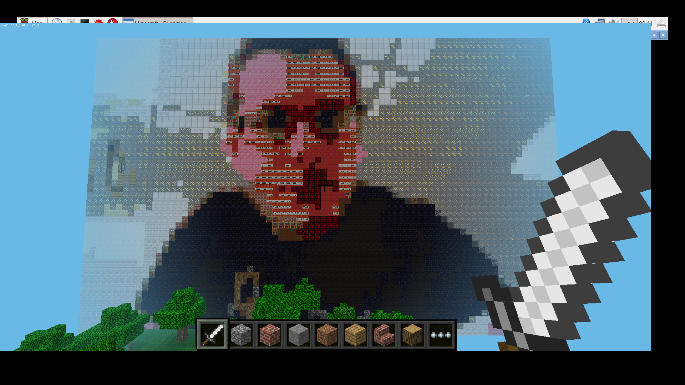

## Starting the Minecraft API

- Now it's time to place the blocks. You'll need to gain access to the Minecraft API to start with and figure out the player's position in the world:

	``` python
	mc = Minecraft.create()
	x, y, z = mc.player.getPos()
	```

- Now comes the clever bit. You're going to *iterate* over all the colours in the `selfie_lab` first of all. To do this you'll need the help of the `enumerate` function, which will keep track of your position in the selfie:

	``` python
	for i, selfie_column in enumerate(selfie_lab):
		for j, selfie_pixel in enumerate(selfie_column):
			distance = 300
	```

These three lines will go over every pixel in the selfie and store each value of the pixel as `selfie_pixel`. The distance will also be set to `300`, and the coordinates of each pixel will be saved as `i`, `j`.

- Next, you need to iterate over every pixel in the colour map in the same way:

	``` python
			for k, map_column in enumerate(map_lab):
				for l, map_pixel in enumerate(map_column):
	```

- Now the distance between the colours of the pixels can be calculated:

	``` python
					delta = color.deltaE_ciede2000(selfie_pixel,map_pixel)
	```
	
- If the `delta` is less than the `distance` that was set before, then `distance` is reset to be the `delta`. The block can then be looked up from the dictionary of colours you set earlier:

	``` python
					if delta < distance:
						distance = delta
						block = colours[(k,l)]
	```

- Now out of that part of the loop, you can set the appropriate block. It's going to be set relative to the player's position, but quite high up in the air:

	``` python
			mc.setBlock(x-j, y-i+60, z+5, block[0], block[1])
	```

- The final part, when combined together, should look like this:

	``` python
	for i, selfie_column in enumerate(selfie_lab):
		for j, selfie_pixel in enumerate(selfie_column):
			distance = 300
			for k, map_column in enumerate(map_lab):
				for l, map_pixel in enumerate(map_column):
					delta = color.deltaE_cie76(selfie_pixel,map_pixel)
					if delta < distance:
						distance = delta
						block = colours[(k,l)]
			mc.setBlock(x-j, y-i+60, z+5, block[0], block[1])
	```

- Try running the code and see what happens. You might need to have a brief hunt around as the blocks are being laid, and be patient as it doesn't happen instantly.

	

