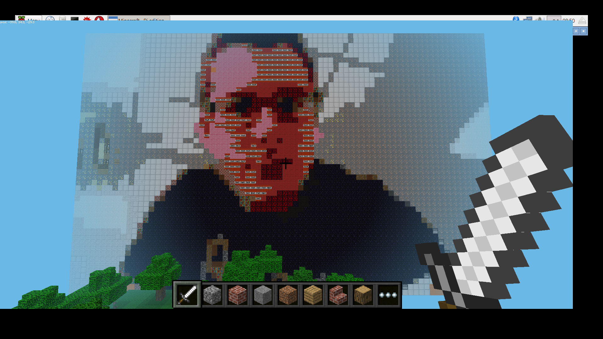

## A better (but slower) algorithm

You can get a more accurate representation by using a different algorithm for calculating the `delta` value. This will be slower, but might give you a better result (so be very patient).

Replace the line

``` python
				delta = color.deltaE_cie76(selfie_pixel,map_pixel)
```

with the line

``` python
				delta = color.deltaE_ciede2000(selfie_pixel,map_pixel)
```



