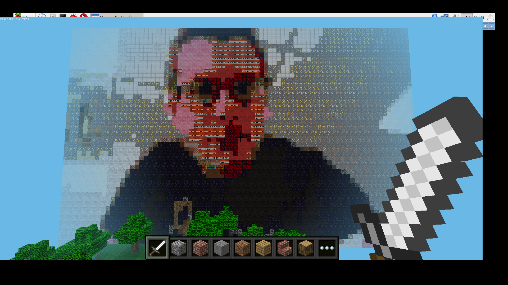

## What it looks like in RGB colour space

Here's an example of what the image looks like if RGB colour space is used. In this example there's not a *huge* difference, but if you want to experiment with higher-resolution images then there would definitely be a difference:



You might not think it's that much different, and it's significantly faster to calculate, so if you'd prefer to use that then the code below will help you out:

``` python
import math

def rgb_colour_space(pixel1, pixel2):
	delta = math.sqrt((pixel1[0]-pixel2[0])**2 + (pixel1[1]-pixel2[1])**2 + (pixel1[2]-pixel2[2])**2)
	return delta

mc = Minecraft.create()
x, y, z = mc.player.getPos()

for i, selfie_column in enumerate(selfie_lab):
	for j, selfie_pixel in enumerate(selfie_column):
		distance = 300
		for k, map_column in enumerate(map_lab):
			for l, map_pixel in enumerate(map_column):
				delta = rgb_colour_space(selfie_pixel, map_pixel)
				if delta < distance:
					distance = delta
					block = colours[(k,l)]
		mc.setBlock(x-j, y-i+60, z+5, block[0], block[1])
```

