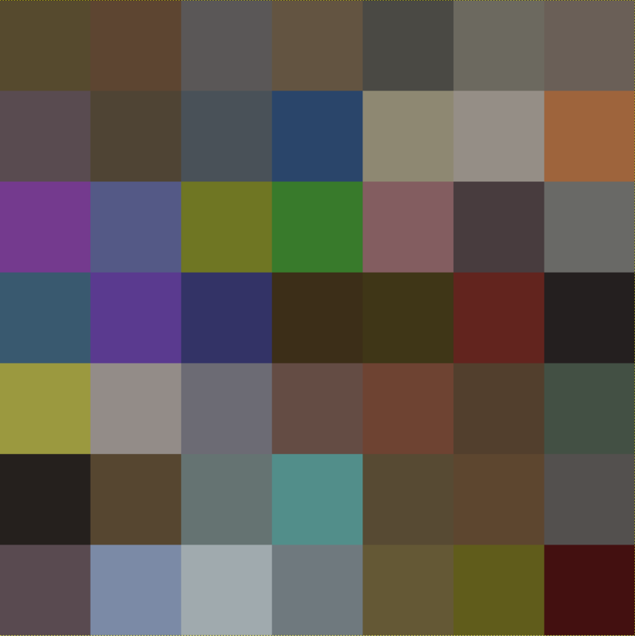

## Mapping colours to blocks

- The next stage will be to download [this colour map](images/colour_map.png). Place it into the same directory as your Python script. The image is tiny (only 7 x 7 pixels), but it looks like this if it's enlarged:



Each pixel on the colour map is the same *average* colour as a Minecraft block. The block in the top-left is *dirt*, for instance.

- You need to load both these images into the program, so that they become represented by lists of numbers. This is where the `skimage` module becomes useful:

	``` python
	selfie_rgb = io.imread("selfie.jpg")
	map_rgb = io.imread("colour_map.png")
	```

- If you run your code now, you can see what these objects look like by switching over to your Python shell and typing:

	``` python
	>>> map_rgb
	```

- Here's an extract of the first part you should see:

	``` python
	array([[[ 86,  74,  46],
			[ 93,  69,  49],
			[ 90,  87,  87],
			[ 99,  84,  65],
			[ 74,  73,  68],
			[108, 105,  95],
			[106,  95,  87]],
	```

- This is a representation of the colours in the colour map. So the first row `86, 74, 46` represents the first pixel in the colour map. It's made up of three numbers: the first is the amount of *red*, the second the amount of *green*, and the third the amount of *blue*. Overall, this gives a brown colour. We call this RGB colour.

- You could look at the pixel colours in your selfie as well:

	``` python
	>>> selfie_rgb
	```

Now that you have the RGB values of the pixels in your selfie and the colours of the blocks from the colour map, if you could find the nearest colour from the map to the one in the selfie, you would know which block to place.

