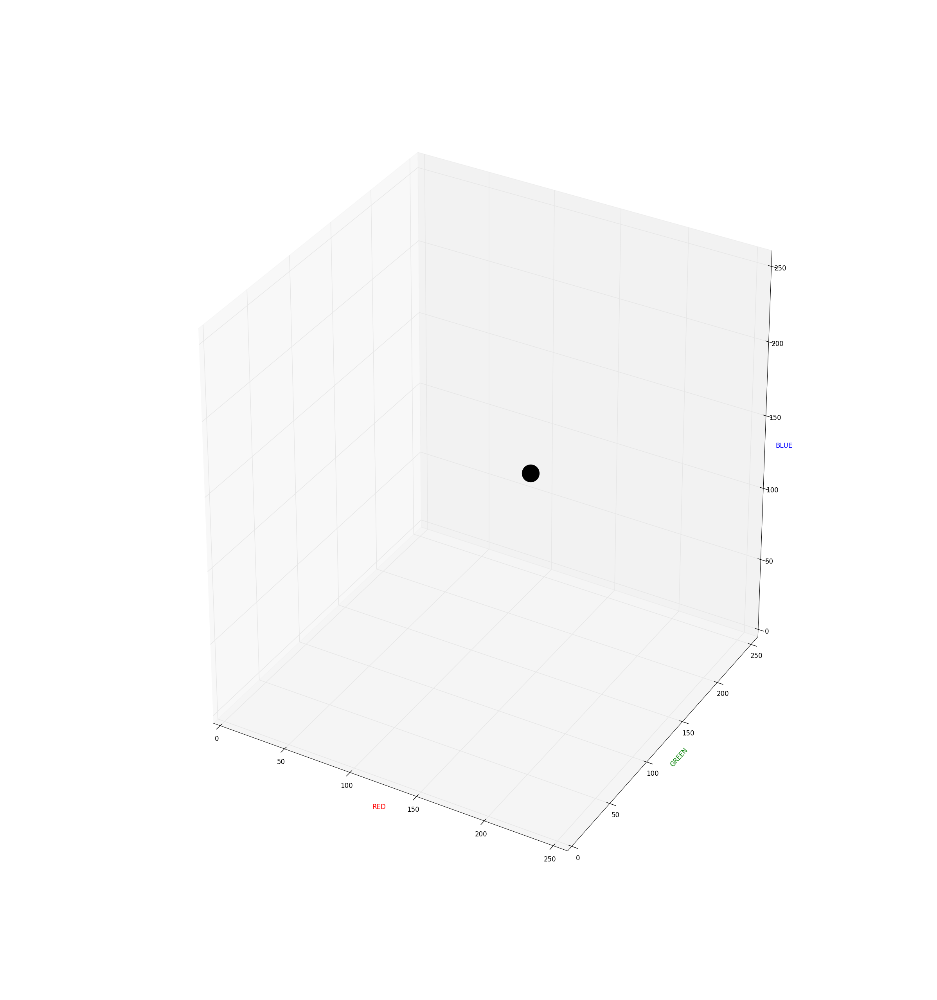
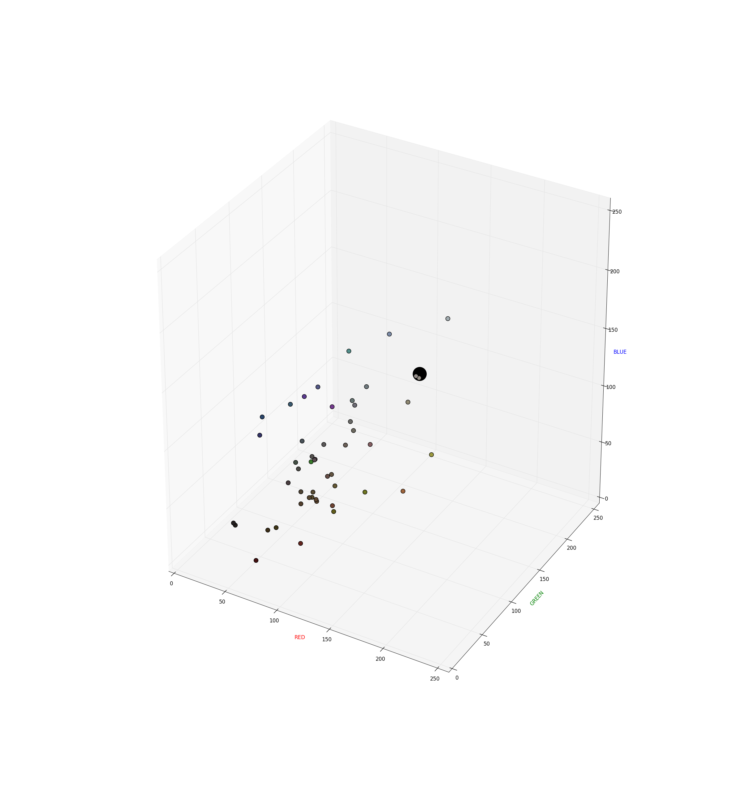
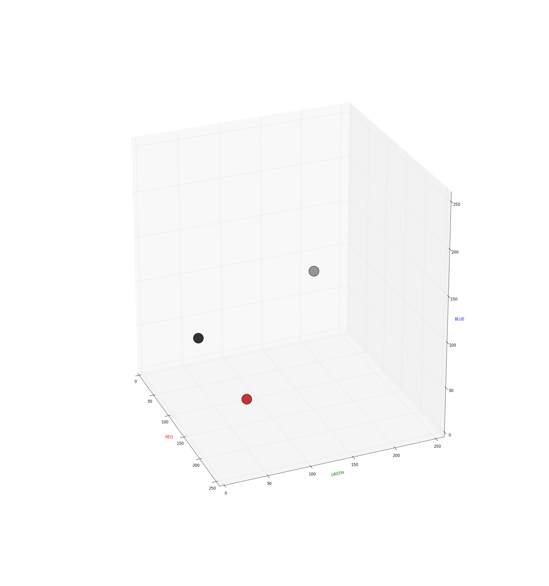

## Finding the nearest colour

_Don't worry if this next bit doesn't make much sense or appears too complicated. You can easily skip it and move on to the next section_.

Each colour is made up of three numbers, so you could plot the position of the colour on a graph. Here's the colour `R - 137, G - 164, B- 123` plotted on a 3D graph:

Now all the colours from the colour map can also be plotted on the same graph, using smaller points so you can still see the original colour:

It stands to reason that the closest dot in 3D space to the original colour would appear to be the closest colour visually. Unfortunately, this is not the case. While RGB values are useful for us when describing colours, they're not very useful for comparing colours. Have a look at the graph below:

Although the dark grey and light grey dots appear to be of a more similar colour, they're actually 173 units apart. Both light grey and dark grey dots are closer to the red (150 units) than they are to each other. For this reason, comparing RGB values is not very useful, as the colours that are close to each other in 3D space may visually appear to be very different.

Because of this, we convert the RGB values into what's known as [Lab colour space](https://en.wikipedia.org/wiki/Lab_color_space). In Lab colour space, distance between colours in 3D space is very similar to our own perception of what could be called similar colours.

