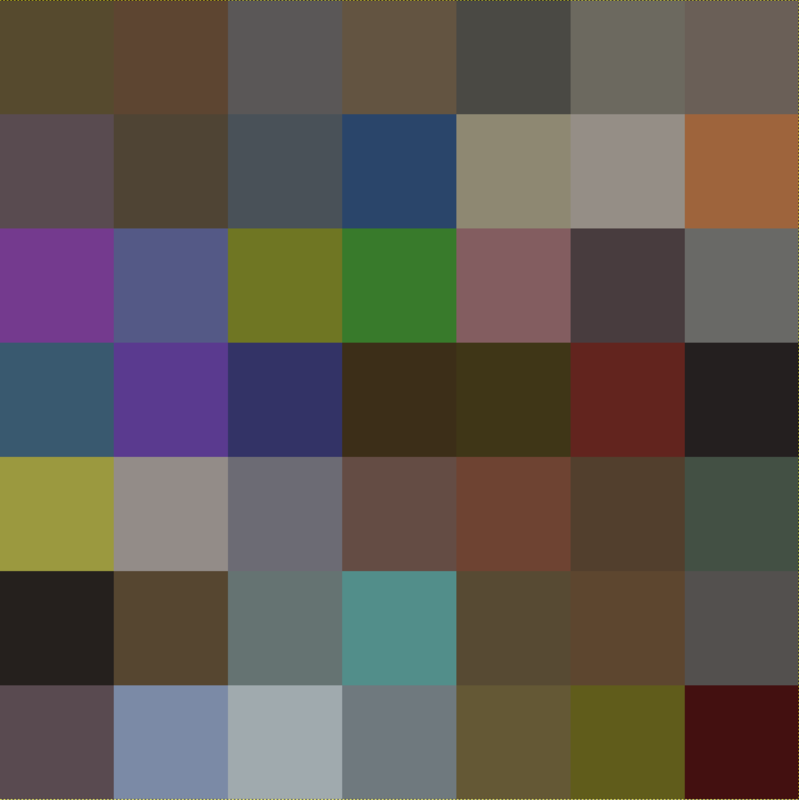
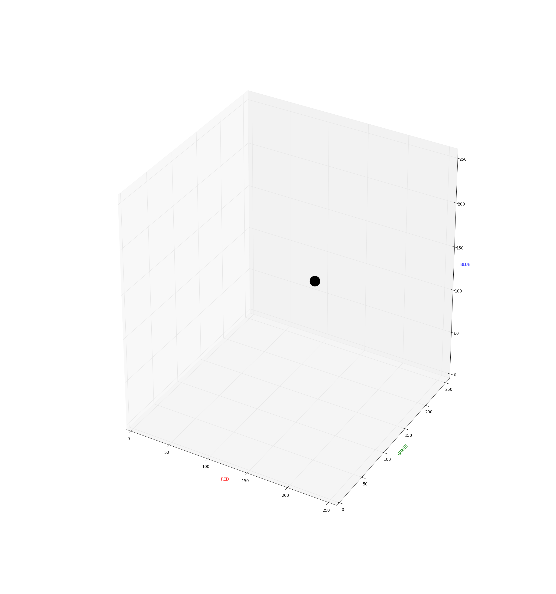
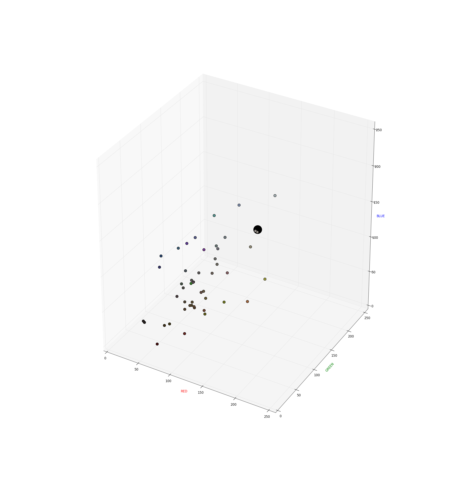
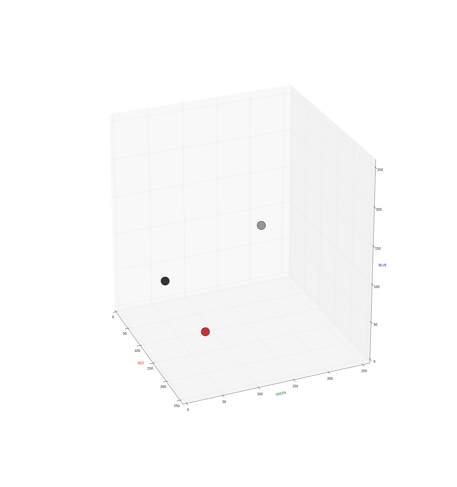
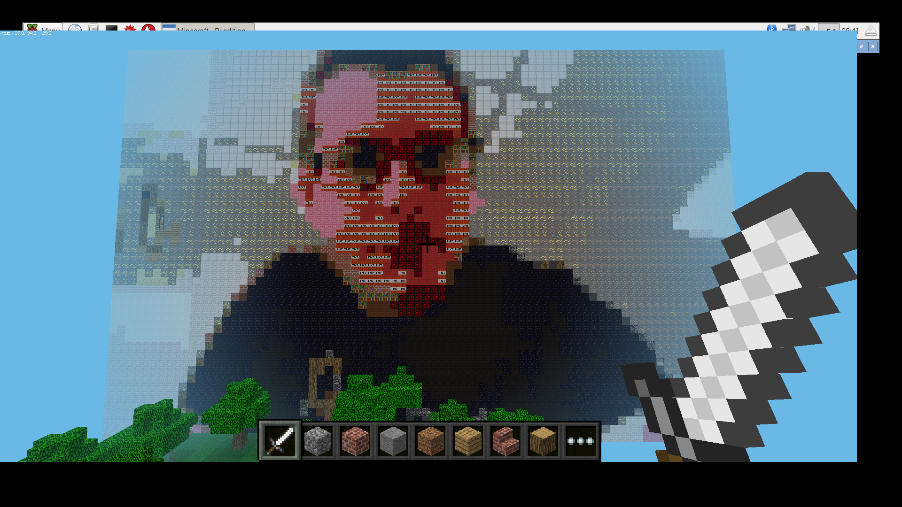
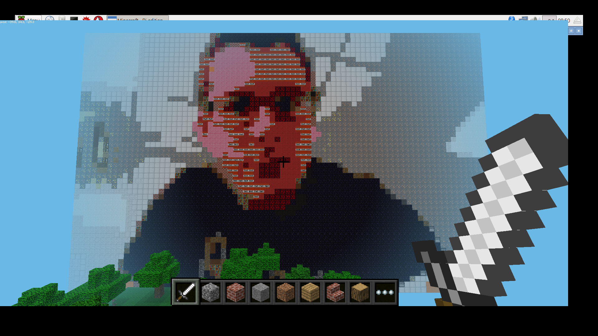
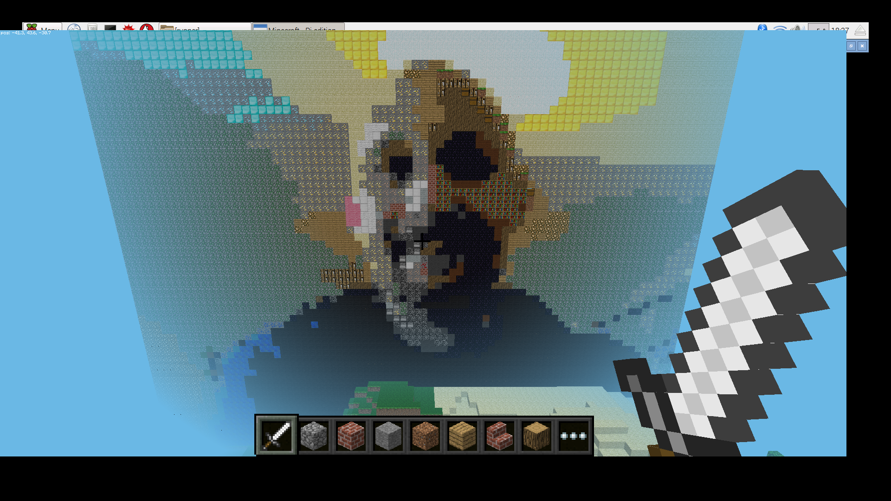

# Minecraft Selfies

In this resource you'll use the Pi Camera to take a selfie of yourself, and then with a bit of Python 3 code you'll render the picture in a gigantic wall of Minecraft blocks.

## Importing some modules

For this project you'll need to begin by importing a few modules. Most of them are pre-installed in Raspbian, but you need to install `skimage` yourself by following the instructions on the [software installation page](https://www.raspberrypi.org/learning/minecraft-selfies/requirements/software/).

1. Open up Python 3 (IDLE) from the Menu.
1. Create a new file by clicking on *File* > *New File*.
1. Now write the following lines in your new file to import the required modules:

	``` python
	from picamera import PiCamera
	from mcpi.minecraft import Minecraft
	from time import sleep
	from skimage import io, color
	```

1. Save your file as `minecraft_selfies.py`, and then run it (by pressing *F5*) to make sure that you have all the required modules installed.

## Taking a selfie

The first stage is fairly simple. You're just going to use the Pi Camera to take a selfie.

1. Below your module imports you can set up the `camera` object and set its resolution with the following two lines:

	``` python
	camera = PiCamera()
	camera.resolution = (80,60)
	```

You could use a larger resolution but the code takes much longer to run, even on a Pi 3.

1. Next, you're going to start a preview of the camera, wait a little bit, then capture an image and save it as `selfie.jpg`:

	``` python
	camera.start_preview()
	sleep(5)
	camera.capture('selfie.jpg')
	camera.close()
	```
1. That's the first part of the script finished. You can run this and take a photo of yourself to test it out. The image will appear in whichever directory you've saved your Python script. It will appear to be very low-resolution, but that's okay.


## Mapping colours to blocks

1. The next stage will be to download [this colour map](images/colour_map.png). Place it into the same directory as your Python script. The image is tiny (only 7 x 7 pixels), but it looks like this if it's enlarged:



Each pixel on the colour map is the same *average* colour as a Minecraft block. The block in the top-left is *dirt*, for instance.

1. You need to load both these images into the program, so that they become represented by lists of numbers. This is where the `skimage` module becomes useful:

	``` python
	selfie_rgb = io.imread("selfie.jpg")
	map_rgb = io.imread("colour_map.png")
	```

1. If you run your code now, you can see what these objects look like by switching over to your Python shell and typing:

	``` python
	>>> map_rgb
	```

1. Here's an extract of the first part you should see:

	``` python
	array([[[ 86,  74,  46],
			[ 93,  69,  49],
			[ 90,  87,  87],
			[ 99,  84,  65],
			[ 74,  73,  68],
			[108, 105,  95],
			[106,  95,  87]],
	```

1. This is a representation of the colours in the colour map. So the first row `86, 74, 46` represents the first pixel in the colour map. It's made up of three numbers: the first is the amount of *red*, the second the amount of *green*, and the third the amount of *blue*. Overall, this gives a brown colour. We call this RGB colour.

1. You could look at the pixel colours in your selfie as well:

	``` python
	>>> selfie_rgb
	```

Now that you have the RGB values of the pixels in your selfie and the colours of the blocks from the colour map, if you could find the nearest colour from the map to the one in the selfie, you would know which block to place.

## Finding the nearest colour

_Don't worry if this next bit doesn't make much sense or appears too complicated. You can easily skip it and move on to the next section_.

Each colour is made up of three numbers, so you could plot the position of the colour on a graph. Here's the colour `R - 137, G - 164, B- 123` plotted on a 3D graph:

	

Now all the colours from the colour map can also be plotted on the same graph, using smaller points so you can still see the original colour:

	

It stands to reason that the closest dot in 3D space to the original colour would appear to be the closest colour visually. Unfortunately, this is not the case. While RGB values are useful for us when describing colours, they're not very useful for comparing colours. Have a look at the graph below:

	

Although the dark grey and light grey dots appear to be of a more similar colour, they're actually 173 units apart. Both light grey and dark grey dots are closer to the red (150 units) than they are to each other. For this reason, comparing RGB values is not very useful, as the colours that are close to each other in 3D space may visually appear to be very different.

Because of this, we convert the RGB values into what's known as [Lab colour space](https://en.wikipedia.org/wiki/Lab_color_space). In Lab colour space, distance between colours in 3D space is very similar to our own perception of what could be called similar colours.

## Converting to Lab colour space

1. The `skimage` module makes conversion to Lab colour space from RGB colour space easy. You just need these two additional lines:

	``` python
	selfie_lab = color.rgb2lab(selfie_rgb)
	map_lab = color.rgb2lab(map_rgb)
	```

## Mapping the blocks

The next part involves mapping the pixels from the colour map to actual Minecraft blocks. A dictionary is used to do this.

Minecraft blocks have two values associated with them; for instance, dirt is `2, 0`. The `0` is used as there's only one type of dirt block. Wool has many types with different colours, so wool can range from `35, 0` up to `35, 15`.

1. The hard work has been done for you here. Below are the pixel values from the colour map `x, y`, mapped to the correct Minecraft block. It's in two forms: the first is if you're copying and pasting from a web page, as it's slightly more condensed, and the second is if you're copying from paper, as it's easier to see the structure.

	``` python
	#for copying from a browser
	colours={(0,0):(2,0),(0,1):(3,0),(0,2):(4,0),(0,3):(5,0),(0,4):(7,0),(0,5):(14,0),(0,6):(15,0),(1,0):(16,0),(1,1):(17,0),(1,2):(21,0),(1,3):(22,0),(1,4):(24,0),(1,5):(35,0),(1,6):(35,1),(2,0):(35,2),(2,1):(35,3),(2,2):(35,4),(2,3):(35,5),(2,4):(35,6),(2,5):(35,7),(2,6):(35,8),(3,0):(35,9),(3,1):(35,10),(3,2):(35,11),(3,3):(35,12),(3,4):(35,13),(3,5):(35,14),(3,6):(35,15),(4,0):(41,0),(4,1):(42,0),(4,2):(43,0),(4,3):(45,0),(4,4):(46,1),(4,5):(47,0),(4,6):(48,0),(5,0):(49,0),(5,1):(54,0),(5,2):(56,0),(5,3):(57,0),(5,4):(58,0),(5,5):(60,0),(5,6):(61,0),(6,0):(73,0),(6,1):(79,0),(6,2):(80,0),(6,3):(82,0),(6,4):(89,0),(6,5):(103,0),(6,6):(246,0)}
	```

	``` python
	#for copying from paper
	colours = {(0, 0): (2, 0),
			   (0, 1): (3, 0),
			   (0, 2): (4, 0),
			   (0, 3): (5, 0),
			   (0, 4): (7, 0),
			   (0, 5): (14, 0),
			   (0, 6): (15, 0),
			   (1, 0): (16, 0),
			   (1, 1): (17, 0),
			   (1, 2): (21, 0),
			   (1, 3): (22, 0),
			   (1, 4): (24, 0),
			   (1, 5): (35, 0),
			   (1, 6): (35, 1),
			   (2, 0): (35, 2),
			   (2, 1): (35, 3),
			   (2, 2): (35, 4),
			   (2, 3): (35, 5),
			   (2, 4): (35, 6),
			   (2, 5): (35, 7),
			   (2, 6): (35, 8),
			   (3, 0): (35, 9),
			   (3, 1): (35, 10),
			   (3, 2): (35, 11),
			   (3, 3): (35, 12),
			   (3, 4): (35, 13),
			   (3, 5): (35, 14),
			   (3, 6): (35, 15),
			   (4, 0): (41, 0),
			   (4, 1): (42, 0),
			   (4, 2): (43, 0),
			   (4, 3): (45, 0),
			   (4, 4): (46, 1),
			   (4, 5): (47, 0),
			   (4, 6): (48, 0),
			   (5, 0): (49, 0),
			   (5, 1): (54, 0),
			   (5, 2): (56, 0),
			   (5, 3): (57, 0),
			   (5, 4): (58, 0),
			   (5, 5): (60, 0),
			   (5, 6): (61, 0),
			   (6, 0): (73, 0),
			   (6, 1): (79, 0),
			   (6, 2): (80, 0),
			   (6, 3): (82, 0),
			   (6, 4): (89, 0),
			   (6, 5): (103, 0),
			   (6, 6): (246, 0)}

	```
1. With the dictionary added, you can test this out in the interpreter. Run your code, then switch to the interpreter and type the following:

	``` python
	>>> colours[(0, 0)]
	```

You should see `(2, 0)` being returned, meaning dirt block.

1. If you type the following:

	``` python
	>>> colours[(3, 3)]
	```

you should see that `(35, 12)` is returned. This means a wool block with a brown colour.

## Starting the Minecraft API

1. Now it's time to place the blocks. You'll need to gain access to the Minecraft API to start with and figure out the player's position in the world:

	``` python
	mc = Minecraft.create()
	x, y, z = mc.player.getPos()
	```

1. Now comes the clever bit. You're going to *iterate* over all the colours in the `selfie_lab` first of all. To do this you'll need the help of the `enumerate` function, which will keep track of your position in the selfie:

	``` python
	for i, selfie_column in enumerate(selfie_lab):
		for j, selfie_pixel in enumerate(selfie_column):
			distance = 300
	```

These three lines will go over every pixel in the selfie and store each value of the pixel as `selfie_pixel`. The distance will also be set to `300`, and the coordinates of each pixel will be saved as `i`, `j`.

1. Next, you need to iterate over every pixel in the colour map in the same way:

	``` python
			for k, map_column in enumerate(map_lab):
				for l, map_pixel in enumerate(map_column):
	```

1. Now the distance between the colours of the pixels can be calculated:

	``` python
					delta = color.deltaE_ciede2000(selfie_pixel,map_pixel)
	```
	
1. If the `delta` is less than the `distance` that was set before, then `distance` is reset to be the `delta`. The block can then be looked up from the dictionary of colours you set earlier:

	``` python
					if delta < distance:
						distance = delta
						block = colours[(k,l)]
	```

1. Now out of that part of the loop, you can set the appropriate block. It's going to be set relative to the player's position, but quite high up in the air:

	``` python
			mc.setBlock(x-j, y-i+60, z+5, block[0], block[1])
	```

1. The final part, when combined together, should look like this:

	``` python
	for i, selfie_column in enumerate(selfie_lab):
		for j, selfie_pixel in enumerate(selfie_column):
			distance = 300
			for k, map_column in enumerate(map_lab):
				for l, map_pixel in enumerate(map_column):
					delta = color.deltaE_cie76(selfie_pixel,map_pixel)
					if delta < distance:
						distance = delta
						block = colours[(k,l)]
			mc.setBlock(x-j, y-i+60, z+5, block[0], block[1])
	```

1. Try running the code and see what happens. You might need to have a brief hunt around as the blocks are being laid, and be patient as it doesn't happen instantly.

	

## A better (but slower) algorithm

You can get a more accurate representation by using a different algorithm for calculating the `delta` value. This will be slower, but might give you a better result (so be very patient).

1. Replace the line

	``` python
					delta = color.deltaE_ciede2000(selfie_pixel,map_pixel)
	```

with the line

``` python
				delta = color.deltaE_ciede2000(selfie_pixel,map_pixel)
```



## What it looks like in RGB colour space

Here's an example of what the image looks like if RGB colour space is used. In this example there's not a *huge* difference, but if you want to experiment with higher-resolution images then there would definitely be a difference:



You might not think it's that much different, and it's significantly faster to calculate, so if you'd prefer to use that then the code below will help you out:

``` python
import math

def rgb_colour_space(pixel1, pixel2):
	delta = math.sqrt((pixel1[0]-pixel2[0])**2 + (pixel1[1]-pixel2[1])**2 + (pixel1[2]-pixel2[2])**2)
	return delta

mc = Minecraft.create()
x, y, z = mc.player.getPos()

for i, selfie_column in enumerate(selfie_lab):
	for j, selfie_pixel in enumerate(selfie_column):
		distance = 300
		for k, map_column in enumerate(map_lab):
			for l, map_pixel in enumerate(map_column):
				delta = rgb_colour_space(selfie_pixel, map_pixel)
				if delta < distance:
					distance = delta
					block = colours[(k,l)]
		mc.setBlock(x-j, y-i+60, z+5, block[0], block[1])
```

## The full code

In case you got lost, here's the full code for the program:

``` python
from picamera import PiCamera
from mcpi.minecraft import Minecraft
from time import sleep
from skimage import io, color

## Taking a picture

camera = PiCamera()
camera.resolution = (80,60)
camera.start_preview()
sleep(15)
camera.capture('selfie.jpg')
camera.close()

## Rendering the picture

### load selfie and map
selfie_rgb = io.imread("selfie.jpg")
map_rgb = io.imread("colour_map.png")


### Convert to Lab

selfie_lab = color.rgb2lab(selfie_rgb)
map_lab = color.rgb2lab(map_rgb)

### Mapping colours on colour map to Minecraft blocks
### First tuple is coordinates of colour map
### Second tuple is Minecraft block

colours={(0,0):(2,0),(0,1):(3,0),(0,2):(4,0),(0,3):(5,0),(0,4):(7,0),(0,5):(14,0),(0,6):(15,0),(1,0):(16,0),(1,1):(17,0),(1,2):(21,0),(1,3):(22,0),(1,4):(24,0),(1,5):(35,0),(1,6):(35,1),(2,0):(35,2),(2,1):(35,3),(2,2):(35,4),(2,3):(35,5),(2,4):(35,6),(2,5):(35,7),(2,6):(35,8),(3,0):(35,9),(3,1):(35,10),(3,2):(35,11),(3,3):(35,12),(3,4):(35,13),(3,5):(35,14),(3,6):(35,15),(4,0):(41,0),(4,1):(42,0),(4,2):(43,0),(4,3):(45,0),(4,4):(46,0),(4,5):(47,0),(4,6):(48,0),(5,0):(49,0),(5,1):(54,0),(5,2):(56,0),(5,3):(57,0),(5,4):(58,0),(5,5):(60,0),(5,6):(61,0),(6,0):(73,0),(6,1):(79,0),(6,2):(80,0),(6,3):(82,0),(6,4):(89,0),(6,5):(103,0),(6,6):(246,0)}

## Iterate over image and then over map. Find closest colour from map, and then look up that block and place

mc = Minecraft.create()
x, y, z = mc.player.getPos()

for i, selfie_column in enumerate(selfie_lab):
	for j, selfie_pixel in enumerate(selfie_column):
		distance = 300
		for k, map_column in enumerate(map_lab):
			for l, map_pixel in enumerate(map_column):
				delta = color.deltaE_cie76(selfie_pixel,map_pixel)
				if delta < distance:
					distance = delta
					block = colours[(k,l)]
		mc.setBlock(x-j, y-i+60, z+5, block[0], block[1])
```

## What next?

- Why not have a go at taking different images other than selfies, and building a wall of family or pet portraits?
- What happens if you use higher-resolution images?
- Could you render a movie in Minecraft blocks?
